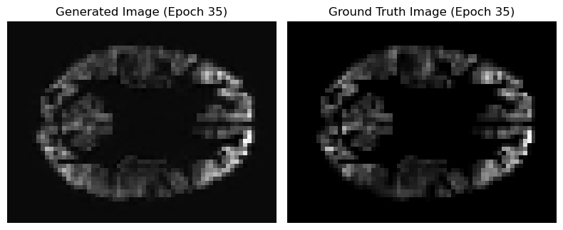
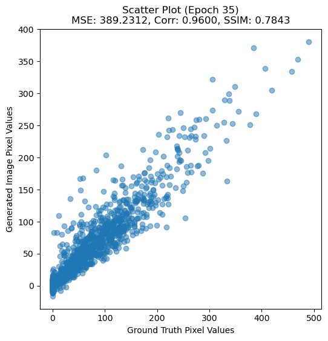
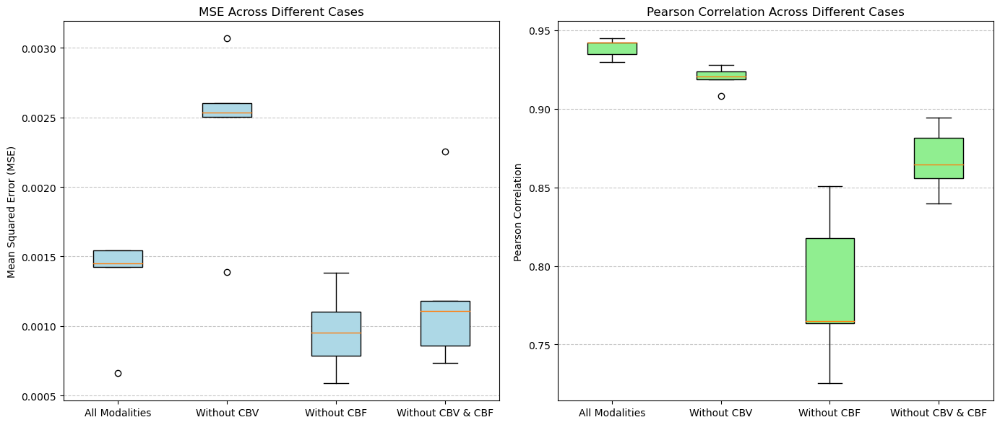

 # CMRO₂ from Synthetic CBV — research notebook

> Estimate cerebral metabolic rate of oxygen (CMRO₂) from qMRI inputs (CBV, CBF, T2, T2*) using a 3D U-Net ensemble inside a conditional GAN framework.  

---

<!-- ## Project pipeline

<!-- [Overview of pipeline](project_pipeline.png)

<!-- **Goal:** Predict CMRO₂ from routinely available MRI (CBV, CBF, T2, T2*).  
**Preprocess:** Apply group GM mask, resample to `48×64×48`.  
**Model:** Generator = ensemble of four 3D U-Nets with residual and attention blocks; Discriminator = 3D CNN with spectral normalization.  
**Output:** Single-channel CMRO₂ volume. -->

---

<!-- ## Model architecture

<!-- [GAN overview](architecture_gan_overview.png)
<!-- [3D U-Net architecture](architecture_unet.png)

---

<!-- ## Training curves (example run)




> Figures are **aggregate** only (no subject-level slices).

---

## Case-study phases (modality ablations)

We evaluate the trained generator under four input configurations:

- **All modalities** (baseline)
- **–CBV**
- **–CBF**
- **–CBV & –CBF**

**Aggregate performance (MSE / Pearson):**  


---

<!-- ## How to use

1. **Environment**
   ```bash
   # create a venv (example)
   python -m venv .venv
   .\.venv\Scripts\activate            # Windows
   # source .venv/bin/activate         # macOS/Linux
   pip install -r requirements.txt


2. **Notebooks**

- **model_training.ipynb** – training + metrics + visualizations
- **case_study.ipynb** – modality ablations (–CBV/–CBF/–CBV&CBF)

3. **Configure paths**

In the first config cell, set:
base_path, gm_mask_base_path, gm_mask_filename
patient_ids (train/test)

No dataset or weights are included. Train on your own data with appropriate permissions. -->

## Data

The MRI data used in this research were collected by Samira Epp. Access for this work was granted by Dr. Gabriel Castrillón.
This repository does not redistribute data or subject-level derivatives.
- Read more: [DATASET.md](DATASET.md) for the expected on-disk layout, modalities, and preprocessing notes.

## Credits

**Author:** Urmi Bhattacharyya ([urmi.bhattacharyya06@gmail.com](mailto:urmi.bhattacharyya06@gmail.com))

### Supervision & collaboration 

- **[Dr. Gabriel Castrillón](https://www.linkedin.com/in/gabocas/)** — supervision, data access, and guidance (TUM/FAU collaboration)  
- **[Prof. Valentin Riedl](https://www.linkedin.com/in/valentin-riedl/)** — conceptualization and supervision (TUM; [GitHub](https://github.com/valentinriedl))

This project was carried out as a collaboration between the **Technical University of Munich (TUM)** and **Friedrich-Alexander-Universität Erlangen-Nürnberg (FAU)** in the Medical Engineering program. It was developed within the scientific direction of the **Neuroenergetics Lab (TUM/FAU)** — org GitHub: https://github.com/NeuroenergeticsLab.


**CRediT roles (summary):**

- Conceptualization: Prof. Valentin Riedl; Dr. Gabriel Castrillón
- Methodology / Software / Pipeline: Urmi Bhattacharyya
- Data curation: Samira Epp

I’m deeply grateful to my supervisors and collaborators—the work would not have been possible without their support.

## Lineage & related work (independent implementation)

This repository is an independent implementation that builds on the scientific direction of the Riedl Lab and the paper by Epp et al. (2023). It does not reuse or modify code from those projects.

Paper: Epp et al., “Two distinct modes of hemodynamic responses in the human brain,” 2023 (bioRxiv).

**Related repo (context only)**: https://github.com/NeuroenergeticsLab/two_modes_of_hemodynamics

Inspiration only; no third-party code from the above is included here.

## References (methods)

- Ronneberger et al., 2015 — U-Net
- Oktay et al., 2018 — Attention U-Net
- He et al., 2015 — Deep Residual Learning
- Miyato et al., 2018 — Spectral Normalization for GANs
- Godfellow et al., 2014 — Generative Adversarial Nets
- Wang et al., Radiology 308(2):e222471, 2023 — CBV synthesis
- Germuska et al., Frontiers in AI 3:12, 2020 — OEF/CMRO₂ mapping

## License & disclaimer

- **License (code)**: MIT — see LICENSE.
- **Scope**: License applies to code only; data and any trained weights remain under their own terms.
- **Disclaimer**: Research use only. Not for clinical decision making.
